  

### 🧑‍💻 About me

- 🎓 Telecommunications Engineering student at the **Universidad Politécnica de Cartagena** (Spain)
- 📡 Into wireless networks and **5G**, especially where they meet **reinforcement learning**
- 🧮 I like hard **optimization** problems: vehicle routing, metaheuristics, local search
- 🏆 Winner of the **SmartEcoRutas** challenge at Retos-UPCT 2026

### 🛠️ Tech I work with

  
  
  
  
  
  
  
  
  

